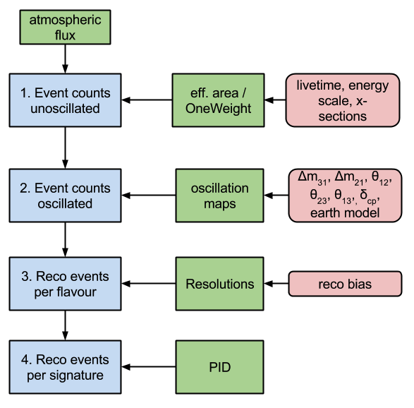

# PISA

PINGU Simulation and Analysis (PISA) is software written for performing analyses based upon Monte Carlo simulations of the [IceCube neutrino observatory](https://icecube.wisc.edu/), including the [DeepCore](https://arxiv.org/abs/1109.6096) low-energy in-fill array and the proposed [PINGU](https://arxiv.org/abs/1401.2046) addition (as well as other similar detectors).
PISA was originally developed to handle the low-statistics Monte Carlo (MC) for PINGU, but has grown into a generally-applicable analysis tool not restricted to a single detector that is also useful for both low- and high-MC analyses.

## Modular architecture

PISA implements a modular architecture where a user can define custom analysis pipelines, and within those pipelines the user can choose among several implementations of each stage of the analysis.
Finally, multiple types of analyses can be run with the defined pipelines, where choice of analysis depends upon desire for speed vs. accuracy.

## Analysis types

PISA implements both what we call ***parameterized-Monte Carlo (MC) stages*** and ***MC-reweighting stages***.
In the former, distributions (and not individual event weights) are modified to reflect the effects of each analysis stage.
In the latter, the individual event weights are modified to reflect these effects.
See the analysis guide for more explanaton of the difference between the two and for guidance on when each is appropriate for use.

An analysis pipline is constructed using stages of one of these two kinds, and multiple pipelines (of either type) can be used within a single analysis.

## How an analysis is structured

All of the analyses possible utilize a "data" distribution.
This can come from an actual measurement or by *injecting* a complete set of assumed-true values for all of the parameters into the analysis pipeline(s) and producing what is called ***Asimov data***—the expected distribution given those parameter values—or ***pseudo data***, which is Asimov data but with random (Poisson) fluctuations applied.
A minimizer attempts to match the "data" distribution (with what is called a template, generated by an analysis pipeline or the combination of multiple pipelines) as closely as possible by varying the parameters.
The "closeness" of match between the generated template and the "data" distribution is measured by a criterion such as chi-squared or log likelihood.

An important question is the significance of the experiment to measure one or more of the above parameters (the *measured parameters*).
To do this, the measured parameters are fixed to a range of values and the matching process above is repeated for each value (with all other parameters—the *nuissance parameters*—allowed to vary).
This shows sensitivity of the closeness criterion to the measured parameters, and hence the ability for the experiment to measure them.
Put another way, this shows the ability of the experiment to distinguish one value of a measured parameter from the next value.

## An example parameterized-MC analysis pipeline



The original drawing is [here](https://docs.google.com/drawings/edit?id=1RxQj8rPndwFygxw3BUf4bx5B35GAMk0Gsos_BiJIN34).

## More information

An excellent (and far more detailed) description of the analysis process is maintained by Elim Cheung with particular application to IceCube/DeepCore atmospheric neutrino measurements [here](http://umdgrb.umd.edu/~elims/Fitter/Basics).
She wrote her own fitter to perform these tasks, and while we of course like PISA, you can evaluate her ezFit software for performing analysis [here](http://code.icecube.wisc.edu/projects/icecube/browser/IceCube/sandbox/elims/ezfit).


# Installation

## Requirements

To install this package, you'll need to have the following non-python requirements
* [git](https://git-scm.com/)
* [hdf5](http://www.hdfgroup.org/HDF5/) — install with `--enable-cxx` option

In Ubuntu Linux, you can install these via
```bash
sudo apt-get install git hdf5
```
although you can also obtain `hdf5` by installing the Anaconda Python distribution (see below).

The Python requirements are
* [python](http://www.python.org) — version 2.7.x required
* [pip](https://pip.pypa.io/) — version > 1.2 recommended
* [numpy](http://www.numpy.org/)
* [scipy](http://www.scipy.org/) — version > 0.12 recommended
* [h5py](http://www.h5py.org/)
* [cython](http://cython.org/)
* [uncertainties](https://pythonhosted.org/uncertainties/)

Optional dependencies to enable add-on features are
* [PyCUDA](https://mathema.tician.de/software/pycuda)
* [openmp](http://www.openmp.org)

Obtaining packages and handling interdependencies is easiest if you use a Python distribution, such as [Anaconda](https://www.continuum.io/downloads) or [Canopy](https://www.enthought.com/products/canopy).
Although the selection of maintained packages is smaller than if you use the `pip` command to obtain packages from the Python Package Index (PyPi), you can stil use `pip` even if you use a Python distribution.

## Install Python
There are many ways of obtaining Python and many ways of installing it.
Here we'll present two basic options, but this is by no means a complete list.

* Install Python 2.7.x from the Python website [https://www.python.org/downloads](https://www.python.org/downloads/)
* Install Python 2.7.x from the Anaconda distribution following instructions [here](https://docs.continuum.io/anaconda/install)

## Set up your environment
* Create a "parent" directory (the directory into which you wish for the PISA sourcecode to live).
Note that subsequent steps will create a directory named `pisa` within the parent directory you've chosen, so you don't need to create the actual `pisa` directory yourself.
```
mkdir -p <parent dir>
```

* To make life easier in the future (and to make these instructons easy to follow), define the environment variable `PISA`.
E.g., for the bash shell, edit your `.bashrc` file and add the line
```
export PISA=<parent dir>/pisa
```
Load this variable into your *current* environment by sourcing your `.bashrc` file:
```bash
. ~/.bashrc
```
(it will be loaded autmatically for all new shells).

## Github setup
1. Create your own [github account](https://github.com/)
1. Obtain access to the `WIPACrepo/pisa` repository by emailing Sebastian Böeser [sboeser@uni-mainz.de](mailto:sboeser@uni-mainz.de?subject=Access to WIPACrepo/pisa github repository)

### SSH vs. HTTPS access to repository
You can interact with Github repositories either via SSH (which allows password-less operation) or HTTPS (which gets through firewalls that don't allow for SSH).
To choose one or the other just requires a different form of the repsitory's URL (the URL can be modified later to change method of access if you change your mind).

#### How to set up password-less access to the repository
If you use the SSH URL, you can avoid passwords altogether by uploading your public key to Github:

1. [Check for an existing SSH key](https://help.github.com/articles/checking-for-existing-ssh-keys/)
1. [Generate a new SSH key if none already exists](https://help.github.com/articles/generating-a-new-ssh-key-and-adding-it-to-the-ssh-agent/)
1. [Add your SSH key to github account](https://help.github.com/articles/adding-a-new-ssh-key-to-your-github-account)
1. [Test the ssh connection](https://help.github.com/articles/testing-your-ssh-connection)

#### How to set up password caching (for SSH or HTTPS)
Git 1.7.10 and later allows storing your password for some time in memory so you aren't asked every time you interact with Github via the command line.
Follow instructions [here](https://help.github.com/articles/caching-your-github-password-in-git/).
This is particularly useful for HTTPS or if you use SSH but do not wish to store a key pair on the computer/server you use.

## Obtain PISA sourcecode

### Developing PISA: Forking
If you wish to modify PISA and contribute your code changes back to the PISA project (*highly recommended!*), fork [`WIPACrepo/pisa`](https://github.com/WIPACrepo/pisa) from Github.
*(How to work with the `cake` branch of PISA will be detailed below.)*

Forking creates your own version of PISA within your Github account.
You can freely create your own *branch*, modify the code, and then *add* and *commit* changes to that branch within your fork of PISA.
When you want to share your changes with `WIPACrepo/pisa`, you can then submit a *pull request* to `WIPACrepo/pisa` which can be merged by the PISA administrator (after the code is reviewed and tested, of course).

* Navigate to the [PISA github page](https://github.com/wipacrepo/pisa) and fork the repository by clicking on the  button
* From a terminal, change into the "parent" directory.<br>
`cd <parent dir>`
* Clone the repository via one of the following commands (`<github username>` is your Github username):
  * either SSH access to repo:<br>
`git clone git@github.com:<github username>/pisa.git`
  * or HTTPS access to repo:<br>
`git clone https://github.com/<github username>/pisa.git`
* Install PISA:<br>
`pip install --src $PISA --requirement $PISA/requirements.txt --editable`
  * `--src $PISA`: Installs PISA from the sourcecode you just cloned in the directory pointed to by the environment variable `$PISA`.
  * `--requirement $PISA/requirements.txt`: Specifies a file containing dependencies for `pip` to install prior to installing PISA.
This file lives at `$PISA/requirements.txt`.
  * `--editable`: Allows for changes to the source code to be immediately propagated to your Python installation.
Basically, within your Python source tree, PISA is just a series of links to your source directory, so changes within your source tree are seen directly by your Python installation.

__Notes:__

* You can work with your installation using the usual git commands (pull, push, etc.).
However, these won't recompile any of the extension (i.e. _C/C++_) libraries.
If you want to do so, simply run<br>
`cd $PISA && python setup.py build_ext --inplace`

* If your Python installation was done by an administrator, if you have administrative access, preface the `pip install` command with `sudo`:<br>
`sudo pip install ...`<br>
If you do not have administrative access, you can install PISA as a user module via the `--user` flag:<br>
`pip install --user ...`

### Using but not developing PISA: Cloning
If you just wish to pull changes from github (and not submit any changes back), you can just clone the sourcecode without creating a fork of the project.

* Change to the directory into which you wish for the sourcecode to live and then clone the project.
```bash
cd $PISA
```
* Clone the WIPACrepo/pisa repository via one of the following commands:
  * either SSH access to repo:<br>
`git clone git@github.com:wipacrepo/pisa.git`
  * or HTTPS access to repo:<br>
`git clone https://github.com/wipacrepo/pisa.git`
* Install PISA:<br>
`pip install --src $PISA --requirement $PISA/requirements.txt --editable`

# Glossary

* **Map**: An object that fundamentally contains a distribution (e.g., histogram) alongside the error and metadata about the distribution (e.g., binning, name, LaTeX representation, ...).

* **Stage**: Each stage represents a critical part of the process by which we can eventually detect neutrinos.
For example, atmospheric neutrinos that pass through the earth will oscillate partially into different flavors prior to reaching the IceCube/PINGU detector.
This part of the process is called the **oscillations** stage.

* **Service**: A particular *implementation* of a stage is called a **service**.
Using the oscillations stage as an example, a service that implements that stage is `pisa.oscillations.Prob3GPUOscillationService.Prob3GPUOscillationService`.
(WeAreMastersOfConcision is our middle name.)
  * Services should be named `<AbbreviatedStageName>Service<ModeName>` (UpperCamelCase).
  * This convention should be followed everywhere to reduce confusion.

* **Resource**: A file with settings, simulated events, parameterizations, metadata, or etc. that is used by one of the services, the template maker, the minimizer, ....
Resources are found in the `$PISA/pisa/resources` directory, where a subdirectory exists for each stage (and several directories exist for resources used for other purposes).

* **Template settings**: The collection of all parameters required to instantiate all services in a simulation chain.
Can be a PISA `template_settings.ini` file or a nested dictionary; formats for these are defined below.

## Implementation Details


### `pisa.analysis.TemplateMaker`
The `TemplateMaker` instantiates and contains services implementing the simulation chain's stages; the functionality of the template maker is best described through its key methods:
* Can load parameters *en masse* from a ***template settings*** file or dictionary
* **`generate_template`** method produces a template based upon all services contained in the template maker (and the state of their parameters at the time of the method call).
* **`match_to_data`** method invokes a minimizer to adjust contained stages' free parameters to best match (either via LLH or chi-squared criteria) a reference template
* **`scan`** method for scanning over a parameter or parameters, either on a grid or via Latin hypercube sampling of the N-diemnsional parameter space.
* **`set_params`**, **`get_params`**, **`get_free_params`** are all methods for working with parameters on a lower level / more individually than the *en masse* characteristic of loading an entire template settings file or dictionary.

### Stages

* There is one base class for all stages: `pisa.stage.Stage` which implements the most basic functionality of a stage, including instantiaton of the two caches pictured above
  * `set_params`, `get_params`, `get_free_params` methods for working with parameters
* Each stage has its own base class, e.g. FluxServiceBase, RecoServiceBase, etc.
  * `apply()` must be aware of all possible systematics.
Their implementations might logically be via other methods within the base class to keep `apply` succinct, but in order to produce a meaningful hash for a transform, `apply` needs to account for *all* the ways that the transform might be modified.
    * Each of which should be called from within the `apply()` method (see below).
  * Implements a method called `apply(<input map>, **kwargs)` (except FluxServiceBase.apply() does *not* take `<input map>`)

* Each particular implementation ("mode") for a stage derives from the stage's base class
  * Each mode must determine how to (efficiently) compute a unique transform hash for its produced data
    * E.g., all of the parameters used for generating the transform should uniquely describe the transform

* Variations
  * The flux stage does not take an input map
  * The oscillation stage does not first produce a "nominal-systematics" transform that then gets computed and then transformed by systematics; this is all one step.

#### Instantiating a stage
Within the `pisa/<stage_shortname>` directory there lives a script file named `<StageShortname>.py`, with first letter capitalized.
This script can be called from the command line to invoke one of the services that implements that stage, as well as stage-wide procedural functions.
There are three important functionalities common to all such scripts:
  * **`service_factory`**: This function is the one place that needs to know about all of the services, as it translates a `<stage_shortname>_mode` string (and the required parameters) into an instantiated service.
Only the single service being instantiated is imported, so incompatibilities that might exist with different services that can't be imported won't keep the user from using the supported service(s).
  * **`add_argparser_args`**: This takes an argparser object, imports all services implementing the stage, and calls the staticmethod `add_argparser_args` from each service to append arguments particular to that service to the command line parser.
(This means that only the individual services need to know about what arguments they use.)
  * **`if __name__ == "__main__"`**: Not necessarily implemented as a function, what follows is the logic to invoke a service from the command line with or without input map sets, plot something useful, and/or write the output map set to a file.

### Caching
Caching all services' transforms and results can speed up the template-making process by a factor of 2-3.

* Transform and result caches are memory-based, least-recently-used (LRU) caches (see `pisa.utils.utils.LRUCache`).
* Disk storage for the nominal-systematics (aka no-systematics) transform defaults to `pingu/resources/.cache/<stage_shortname>/<service_name>.nominal_transform.hdf5`.

#### Hashes
Caching requires the *fast* generation of unique identifiers for each item stored in the cache.
Any hash collisions will cause corruption of the results, so hashing needs to be done carefully so as to make the odds of a collision vanishingly small.

* **Hashes for transforms**: Each service is respoinsible for generating a unique hash for its transform (e.g., based upon parameters used to produce the transform).
* **Hashes for maps sets**: The service that produces a set of maps is also responsible for producing the map-set's hash.
The hash is derived from a tuple of the input maps' hash and the transform hash.
As this logic is consistent across all stages & services (so long as a flux input hash is used), it is implementated in the generic `pisa.stage.Stage` base class.
* The class `pisa.utils.utils.DictWithHash` is provided for conveniently passing transforms and map sets around with hashes attached.
Note that it is the user's responsibility to ensure that the `hash` attribute of those objects is not out of sync with respect to the data contained within them.
This can done manually after updating the data by calling the `DictWithHash` object's method `update_hash` with a simple object (or an already-computed hash) as its argument (see help for that method for more details).
To ensure such consistency between contents and hash, it is recommended to modify the data contents in the `try` clause and update the hash in the `else` clause of a `try-except-else` code block.

### Updating PISA

**Developer mode:**

To upgrade to new version of PISA, just run the install command again with a new version number and the `--upgrade` flag.

**Developer mode:**

The simplest way to update PISA is just to checkout the version you want in git.
However, this will not update the version number for `pip`, and it also won't recompile the `prob3` oscillation package.
In order to get those updated, the best way is to

1. Make sure your _fork_ of PISA on github has the right version
2. Run the install command again
```bash
pip install --src <your/source/dir> --editable git+https://github.com/<user>/pisa@<branch>#egg=pisa
```
Git will automatically realize that there is already a version of PISA in `<your/source/dir>`, so it will just update, but won't delete any of the files you have in there.

## Data formats

This [working document](https://docs.google.com/document/d/1qPVrtECZUDHVVJz_CncCemqmeHk5nOgPlceIU7-jNGc/edit#) describes some of the data formats that will be used in the different steps.
