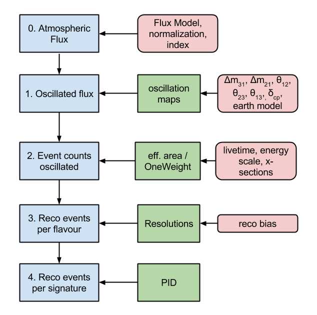

## About PISA

PISA implements a modular architecture wherein users can combine one or more analysis pipelines into distribution makers to make "data" and—separately—template distributions.
Within each pipeline, users can choose among several implementations for each of the stages they choose to include.

Finally, multiple types of analysis can be performed using the generated distributions to ultimately characterize the ability of the detector to make a measurement.

### Analysis types

PISA implements both what we call ***parameterized-Monte Carlo (MC) stages*** and ***reweighted-MC stages***.
In the former, distributions (and not individual event weights) are modified to reflect the effects of each analysis stage.
In the latter, the individual events' weights and properties (such as reconstructed energy) are modified directly to reflect the effects of the detector, and only in the end are the events histogrammed to characterize their distribution.

See the analysis guide for more explanaton of the difference between the two.

### How an analysis is structured

All of the analyses possible utilize a "data" distribution.
This can come from an actual measurement or by *injecting* a set of assumed-true values for the various parameters into the analysis pipeline(s) and producing what is called ***Asimov data***—the expected distribution given those parameter values—or ***pseudo data***, which is Asimov data but with random (Poisson) fluctuations applied.
A minimizer attempts to match the "data" distribution with a template by varying the parameters used to generate the template.
The "closeness" of match between the generated template and the "data" distribution is measured by a criterion such as chi-squared or log likelihood.

An important question is the significance of the experiment to measure one or more of the above parameters (the *measured parameters*).
To do this, the measured parameters are fixed successively to a range of values and, at each value, the matching process above is repeated with all other parameters—the *nuissance parameters*—allowed to vary.
This shows sensitivity of the criterion to the measured parameters, and hence the ability for the experiment to measure those parameters.
Put another way: The more the closeness creiterion varies with a change in the measurement parameters (after the nuissance parameters have done their best to try to make the templates all look like the data), the better able the experiment is to distinguish between values of the measured parameters.

### An example parameterized-MC analysis pipeline

The original drawing is [here](https://docs.google.com/drawings/edit?id=1RxQj8rPndwFygxw3BUf4bx5B35GAMk0Gsos_BiJIN34).

### More information about analysis

An excellent (and far more detailed) description of the analysis process is maintained by Elim Cheung with particular application to IceCube/DeepCore atmospheric neutrino measurements [here](http://umdgrb.umd.edu/~elims/Fitter/Basics).
She wrote her own fitter to perform these tasks. You can evaluate her ezFit analysis software as an alternative to (or as a complementary tool for comparing results with) PISA [here](http://code.icecube.wisc.edu/projects/icecube/browser/IceCube/sandbox/elims/ezfit).
