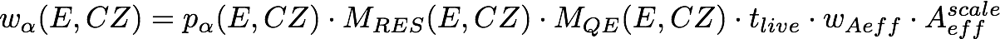
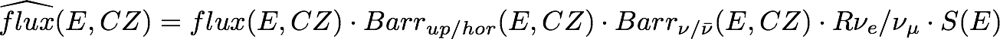

# Stage: reweighted MC

This stage generates event rate templates with 'traditional' MC reweighting (in contrast to the PISA histo mode)

## Services

only a gpu based method is available right now, requiring a Nvidia GPU

### gpu

This service generates histograms, given a set of MC events that also include nominal flux weights.
Weights are calculated for every event and flavor/interaction type (alpha) individually, according to the following expression

<!---
w_\alpha(E,CZ) = p_\alpha(E,CZ) \cdot M_{RES}(E,CZ) \cdot M_{QE}(E,CZ) \cdot t_{live} \cdot w_{Aeff} \cdot A_{eff}^{scale}
--->

where:
  * `M RES` and `M QE` are precalculated GENIE systematics
  * `t live` the livetime
  * `W Aeff` the precalculated effective area weight (including OneWeight and cross section)
  * `A eff scale` a global scaling parameter
  * `p alpha` the probability of observing the event in this flavor/inttype calculates as:

<!---
p_\alpha(E,CZ) = P^{osc}_{e\rightarrow\alpha}(E,CZ) \cdot \widehat{flux}_e(E,CZ) + P^{osc}_{\mu\rightarrow\alpha}(E,CZ) \cdot \widehat{flux}_\mu(E,CZ)
--->

where:
  * `P osc` is the oscillation probability (obtained from Prob3)
  * `flux hat` the modified flux given by:

<!---
\widehat{flux}(E,CZ) = flux(E,CZ) \cdot Barr_{up/hor}(E,CZ) \cdot Barr_{\nu/\bar{\nu}}(E,CZ) \cdot R{\nu_e/\nu_\mu} \cdot S(E)
--->

where:
  * `flux` is the nominal flux that is obtained for example from the Honda flux tables
  * `Barr up/hor`, `Barr nu/nubar` and `R nue/numu` are flux ratio uncertainties
  * `S` the systematic uncertainty on the spectral index

The events get histogrammed on GPU into the provided bin edges for reconstructed energy and cos(zenith), as well as PID (cscade or track). At the moment the division into PID classes is two separate histograms at the moment, not a real binning.

In this implementation the histograms are added up for all flavor/inttypes in the end of the stage, while also applying additional scale factors for the tau neutrino and the NC histograms.
