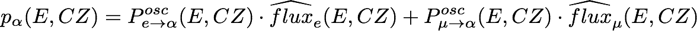

# Stage X: reweighted MC

This stage generates event rate templates with 'traditional' MC reweighting (in contrast to the PISA histo mode)

## Services

only a gpu based method is available right now, requiring a Nvidia GPU

### gpu

This service generates histograms, given a set of MC events that also include nominal flux weights.
Weights are calculated for every event and flavour/interaction type (alpha) indicvidually, according to the following expression

where:
  * `M_RES` and `M_QEare` precalculated GENIE systematics
  * `t_live` the livetime
  * `W_Aeff` the precalculated effective area weight (including oneweight and crosssection)
  * `A_eff^scale` a global scaling paramter
  * `p_alpha` the probability of observing the event in this flaveour/inttype calculates as:

where:
  * `Posc` is the oscialltion probability (obtained from Prob3)
  * `flux_hat` the modified flux given by:

where:
  * `flux` is the nominal flux that is obtainef for aexample from the Honda flux tables
  * `Barr up/hor`, `Barr nu/nubar` and `R nue/numu` are flux ratio uncertainties uncertainties
  * `S` the systematic uncertainty on the spectral index

<!---
latex
w_\alpha(E,CZ) = p_\alpha(E,CZ) \cdot M_{RES}(E,CZ) \cdot M_{QE}(E,CZ) \cdot t_{live} \cdot w_{Aeff} \cdot A_{eff}^{scale}
p_\alpha(E,CZ) = P^{osc}_{e\rightarrow\alpha}(E,CZ) \cdot \widehat{flux}_e(E,CZ) + P^{osc}_{\mu\rightarrow\alpha}(E,CZ) \cdot \widehat{flux}_\mu(E,CZ)
\widehat{flux}(E,CZ) = flux(E,CZ) \cdot Barr_{up/hor}(E,CZ) \cdot Barr_{\nu/\bar{\nu}}(E,CZ) \cdot R{\nu_e/\nu_\mu} \cdot S(E)
--->
