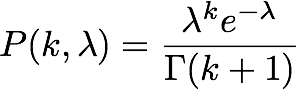
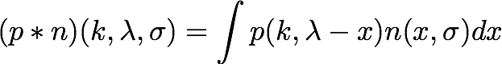
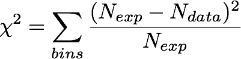
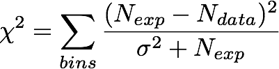
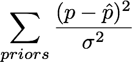

# Statistics functions

The `stats.py` file contains a collection of function to calculate statistical measures from PISA MapSets

## Log-Likelihoods

These all assume that our data is poisson distributed with the usual definition of its pdf as:

<!---
P(k,\lambda) = \frac{\lambda^k e^{-\lambda}}{\Gamma(k+1)}
--->

Note that k-factorial was replaced by the gamma function to generalize it to non-integer values (used in Asimov calculations)

The logarithem of the actual likelihood is used for numerical reasons, which also means the total likelihood becomes a sum instead of a product, just sayin'... 

### llh

The log-likelihood calculates the total of the bin-by bin log-likelihood given two maps representing `k` (= observed values) and `lambda` (= expected values).

### conv_llh

This likelihood takes into account any uncertainties on the expected values (from e.g. finite MC statistics). This is achieved by smearing out the simple poisson pdf with a nromal distribution `n` centered at 0. The width of this normal distribution is the uncertainty on the expected values.

<!---
(p*n)(k,\lambda, \sigma) = \int{p(k,\lambda-x)n(x,\sigma)dx}
--->

The integral is calculated as a discrete sum with `N` steps.

### barlow_llh

This likelihood takes into account the finite MC statistics uncertainties on the expected values as described in [this paper](https://inspirehep.net/record/35053/).

## Chi-Square Values

These are the Chi-Squared values expressing the compatibility of two MapSets. In the limit of large nummbers this should give the same result as `-2*llh`.

### chi2

This calculates the total chi2 values over all bins.

<!---
\chi^2 = \sum_{bins}\frac{(N_{exp}-N_{data})^2}{\sqrt{N_{exp}}^2}
--->

### mod_chi2

The modified Chi-Squared expression is increasing the denominator term. The denominator can be understood as a Variance with `N ` corresponding to the usual poisson variance and any additional error added as `sigma^2`.

<!---
\chi^2 = \sum_{bins}\frac{(N_{exp}-N_{data})^2}{\sigma^2 + N_{exp}} 
--->

## Prior Penalties

Parameters with a non-uniform prior are added to the final `llh` or `chi2` value. but done in `priors.py`. This is mentionned here just for the sake of completenes.

<!---
\sum_{priors}\frac{(p-\hat{p})^2}{\sigma^2}
--->

